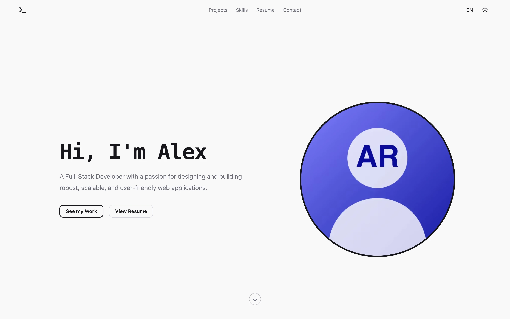
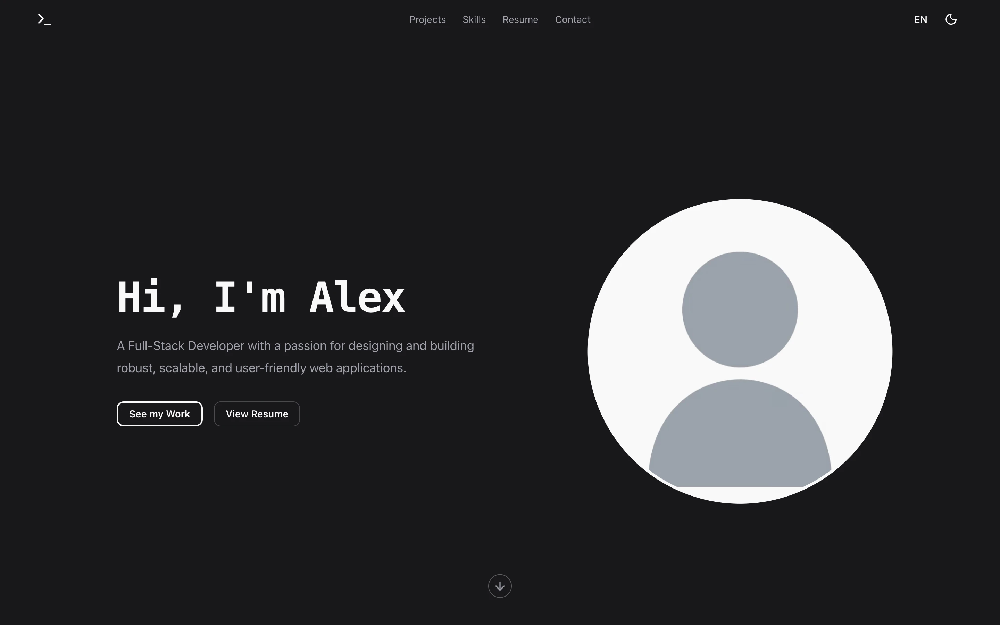
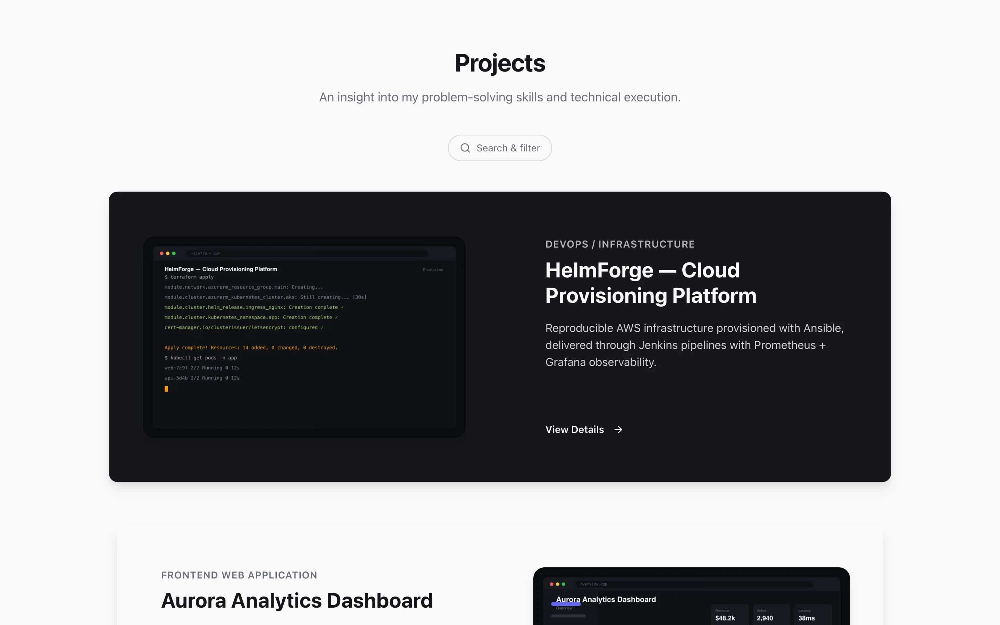
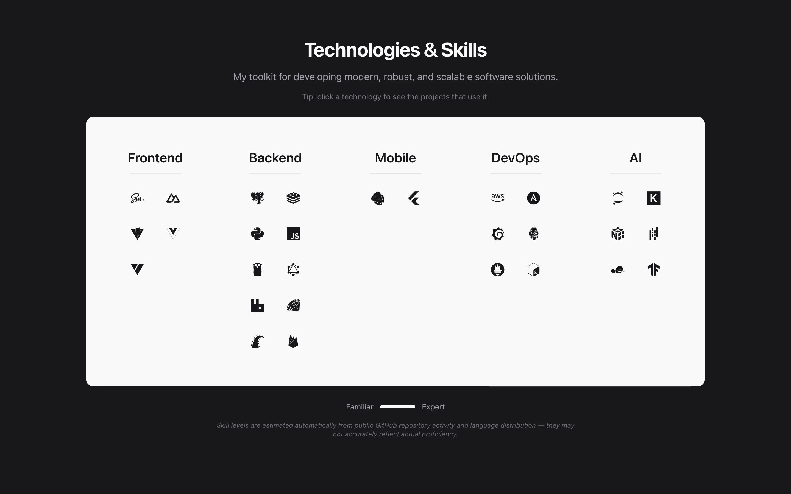
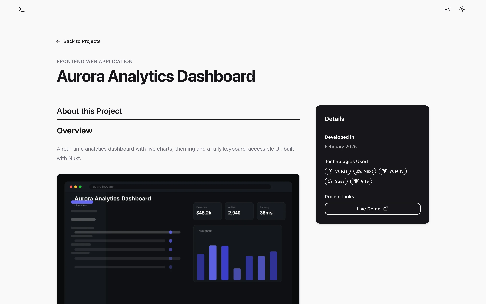
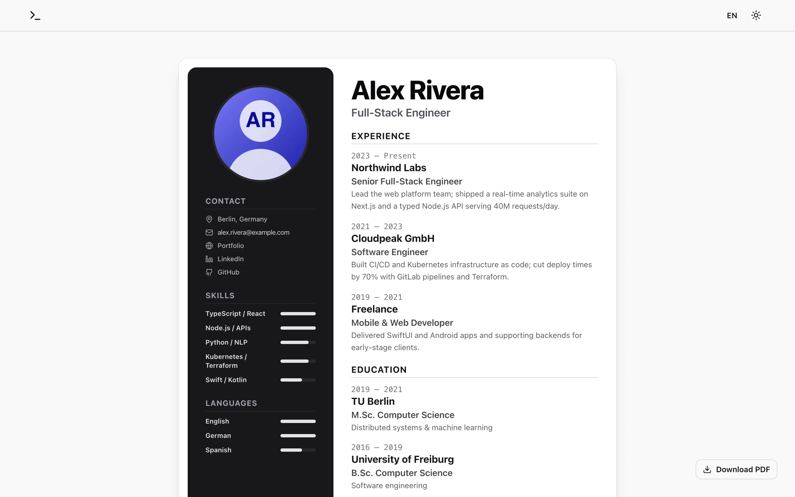

<!-- portfolio:date=2025-06-01 -->

# Codebase — a config-driven, GitHub-powered portfolio

**🌐 [English](README.md) · [Deutsch](README.de.md)**

A fast, SEO-optimized, fully bilingual (EN/DE) developer-portfolio **template**.
It contains **zero personal data** — everything (projects, skills, résumé,
identity, legal pages) is injected at build time from your GitHub repositories
and a single private config repo. Adapting it to your own portfolio is a matter
of adding a topic to your repos and filling one config file; no code changes
required.

<p align="center">
  
  
</p>
<p align="center">
  
  
</p>
<p align="center">
  
  
</p>

> The screenshots above are rendered from the bundled **demo dataset** — no real
> data. Run the demo yourself with `PORTFOLIO_DEMO=1 npm run build`.

---

## Features

- **Config-driven, zero personal data in the repo.** Your identity, SEO, and the
  legal imprint/privacy text all come from one `site.config.json`. The published
  template ships only generic placeholders.
- **GitHub-native project import.** A project is any repo you tag `portfolio`
  (shown with a code link) or `portfolio-private` (shown without one). Its
  localized `README.md` / `README.de.md` becomes the detail page, its description
  the card overview, and its topics the tags. No per-repo metadata files.
- **Fully bilingual (EN/DE)** via `next-intl`, with localized routes, résumé,
  project content, and `hreflang`/Open Graph metadata.
- **Dynamic tech icons.** Tags resolve to [devicon](https://devicon.dev) icons and
  doc links automatically (the full devicon manifest is merged with a small
  curated registry), so new technologies get an icon without any config.
- **Relevance-ranked skills**, derived from your real code (see below).
- **Unified search & filter** — one expandable control with category/technology
  **tokens**, ranked autocomplete, free-text search across every project field,
  faceted matching, and client-side **pagination**. Clicking a skill filters the
  projects that use it.
- **Polished motion** — scroll-driven theme-inverting project cards, and a custom
  rAF in-page scroll that survives layout shifts (hover, filtering) where native
  smooth-scroll would stall.
- **Legal pages** (imprint + privacy) generated from config, **contact form**
  (SMTP), and optional cookieless **Umami** analytics.
- **Static output** — everything is generated at build time; there is no runtime
  fetching, so the live site is just static files.
- **Bundled demo dataset** so a clean clone (or a public live demo) renders a
  full, realistic site with no secrets.

---

## How skill levels & relevance are calculated

At build time each project contributes to a per-technology score. Two numbers are
derived:

**1. Proficiency level (the 1–5 bar):** a continuous score is accumulated per
technology and bucketed into levels.
- A **language** contributes `(its share of the project's bytes) × project weight`
  — only languages ≥ 5 % of the codebase count.
- A **framework / library / tool tag** contributes the full `project weight`.
- An optional `baseScore` per technology can nudge the result.
- Thresholds: `≥6 → 5`, `≥4 → 4`, `≥3 → 3`, `≥2 → 2`, else `1`.

**2. Relevance (ranking within a category, deeper than the level):** used to order
skills and keep only the **top 12 per category** so categories don't grow
unbounded as you add projects.

```
relevance = depth            (the continuous score above)
          + breadth × 1.5    (number of distinct projects using it)
          + recency × 2.0    (recency = exp(−ageYears / 2), ~1.4-year half-life)
```

So a technology you used recently, across several projects, ranks above a
one-off from years ago even at the same displayed level.

---

## Data handling & architecture

```
portfolio-config repo (private, topic: "portfolio-config")   ← the ONE place you personalize
  .portfolio/site.config.json   identity, SEO, legal hosting/analytics
  .portfolio/resume.json        CV data for the /resume page
  .portfolio/profile.png        avatar
  .portfolio/resume.pdf         downloadable CV (optional)
        │  (fetched at build time, never committed to this repo)
        ▼
this template repo  ──►  npm run build  ──►  static, personalized site
        ▲
        │  project repos: add the topic "portfolio" (or "portfolio-private")
```

At build time, `scripts/fetch-portfolio.ts`:

1. Lists your repos and selects the `portfolio` / `portfolio-private` ones; reads
   each project's localized README (images downloaded & converted to WebP), the
   repo description, and topics.
2. Resolves personalization in order: **config repo** (auto-detected via the
   `portfolio-config` topic) → local `config/` → committed
   `config/site.config.example.json` → bundled **demo** dataset.
3. Aggregates skills (above) and writes `src/data/{projects,skills,resume,site.config}.json`.
4. Next.js builds a fully static site from those files.

`src/lib/config.ts` exposes the resolved config as a typed `siteConfig`. A repo's
date can be corrected with an HTML comment in its README:
`<!-- portfolio:date=YYYY-MM-DD -->`.

**Privacy:** the generated data (`src/data/*.json`), the avatar, the OG image, and
project media are all gitignored — they never enter the published template.

---

## Setup

```bash
cp .env.example .env.local        # add GITHUB_TOKEN (+ SMTP / Umami if needed)
npm install
npm run build                     # runs fetch-portfolio.ts, then next build
npm run dev                       # http://localhost:3000
```

A `GITHUB_TOKEN` (repo scope) lets the build read your repos and private config
repo. Without it, the build serves the **demo dataset** so a clean clone always
produces a full site.

**Make it yours:**
1. Create a private `portfolio-config` repo, tag it with the `portfolio-config`
   topic, and add `.portfolio/site.config.json` (see
   [`config/site.config.example.json`](config/site.config.example.json)) +
   `resume.json` + `profile.png`.
2. Tag any project repo with the `portfolio` topic and give it a `README.md`
   (+ `README.de.md` for German). Add other topics as tech tags.
3. Rebuild.

### Running the demo

```bash
PORTFOLIO_DEMO=1 npm run build && npm start
```

Serves the committed [`demo/`](demo/) dataset: 6 mock projects, a generic
persona, résumé, and on-brand mock screenshots. Regenerate the demo assets with
`npx tsx scripts/generate-demo-assets.ts`.

---

## Deployment

GitHub Actions builds a Docker image, pushes it to GHCR, and triggers a redeploy
([`.github/workflows/deploy.yml`](.github/workflows/deploy.yml)). `GITHUB_TOKEN`
is passed only as a BuildKit secret — never baked into an image layer. A public
**live demo** can be deployed with no secrets at all (demo mode kicks in).

---

## Tech stack

Next.js 15 (App Router) · React 19 · TypeScript · Tailwind CSS · next-intl ·
Framer Motion · sharp · nodemailer · Umami · Docker.

## License

Distributed under the CC BY-NC 4.0 License. See [`LICENSE`](LICENSE) for details.
